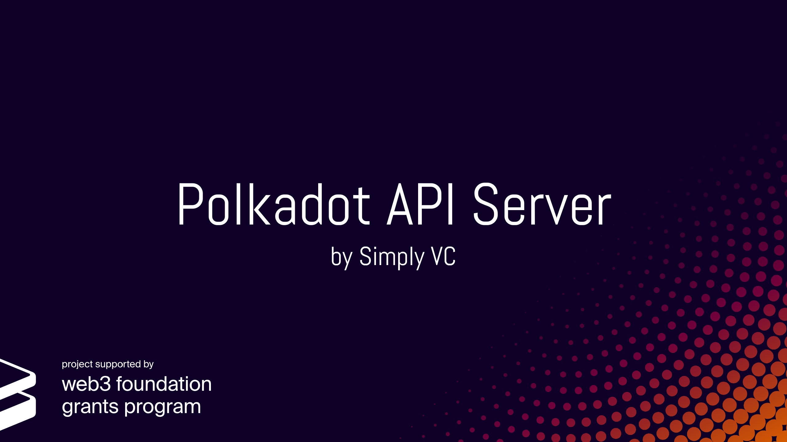

# Polkadot API Server

The Polkadot API Server is a wrap-around of the [polkadot-js/api](https://polkadot.js.org/api/). This makes it easier to use the polkadot-js/api with any programming language in order to query data from Polkadot nodes. In addition to this, a number of custom defined calls were also implemented in the API Server. For example, one can query directly the amount of tokens a validator has been slashed at any block height.

The API Server was specifically built as a way for [PANIC](https://github.com/SimplyVC/panic_polkadot) to be able to retrieve data from the Polkadot nodes that it will monitor. As a result, not all functions from the polkadot-js/api were included in the API Server.
If you would like any endpoint specified in the [RPC docs](https://polkadot.js.org/api/substrate/rpc.html) or the [query docs](https://polkadot.js.org/api/substrate/storage.html) to be implemented, kindly [open an issue](https://github.com/SimplyVC/polkadot_api_server/issues) and we will consider adding it in a future release. You might also want to have a look at our [contribution guidelines](CONTRIBUTING.md), especially if you want to try adding it yourself.

## Design and Features

If you want to dive into the design and feature set of the API Server [click here](doc/DESIGN_AND_FEATURES.md).

## Ready, Set, Query!

If you are ready to try out the API Server on your Polkadot nodes, setup and run the API Server using [this](doc/INSTALL_AND_RUN.md) guide.