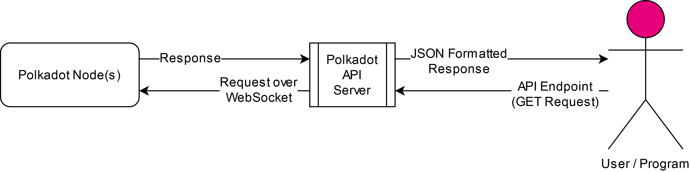

# Design and Features of the Polkadot API Server

This page will present the inner workings of the API Server as well as the features that one is able to interact with and how. The following points will be presented and discussed:

- [**Design**](#design)
- [**Complete List of Endpoints**](#complete-list-of-endpoints)
- [**Using the API**](#using-the-api)

## Design

The components involved in the API Server are the following:
- The **Polkadot Nodes** from which the API retrieves information
- This **API Server** which uses the `@polkadot/api` JavaScript package to retrieve data from the Polkadot Nodes
- The **User/Program** which sends `GET Requests` to the `API Server` as per the defined Endpoints, and receives JSON formatted responses from the `API Server`

The diagram below gives an idea of the various components at play when the API Server is running, and how they interact with each other and the user/program:



The API Server works as follows:
- The API Server connects to each of these nodes one by one, as specified in the `config/user_config_nodes.ini` file.
- The API connections to each node exist within JS as `promise` objects.
- The API Server opens a port, as specified in the `config/user_config_main.ini` file.
- By communicating through this port, the API Server receives the endpoints specified in the `Complete List of Endpoints` section below, and requests information from the nodes it is connected to accordingly.
- Once the requested information is received from the node, it is formatted as a JSON, and returned.

## Complete List of Endpoints

| API Endpoint | Required Inputs | Optional Inputs | Output |
|---|---|---|---|
| **Miscellaneous** | | | |
| `/api/pingApi` | None | None | `pong` if the API is accessible |
| `/api/pingNode` | `websocket` | None | `pong` if the API could access the Node |
| `/api/getConnectionsList` | None | None | List of `nodes` (websocket_ips) the API is connected to |
| **RPC** | | | |
| `/api/rpc/chain/getBlockHash` | `websocket` | `block_number` | `block hash` of the specified block, or of the latest block if one is not specified |
| `/api/rpc/chain/getFinalizedHead` | `websocket` | None | `block hash` |
| `/api/rpc/chain/getHeader` | `websocket` | `hash` | `header` of the specified block hash, or of the latest block if the hash is not specified |
| `/api/rpc/rpc/methods` | `websocket` | None | `version` and `methods`, a list of RPC methods that are exposed by the node |
| `/api/rpc/system/chain` | `websocket` | None | `system chain` |
| `/api/rpc/system/health` | `websocket` | None | `system health` - `peers`, `isSyncing` |
| `/api/rpc/system/networkState` | `websocket` | None | `peerId`, `listenedAddresses`, `externalAddresses` and `connectedPeers` for the specified node. The current state of the network |
| `/api/rpc/system/properties` | `websocket` | None | `ss58Format`, `tokenDecimals` and `tokenSymbol` for the network of the specified node. Properties defined in the chain spec |
| **Query** | | | |
| `/api/query/balances/totalIssuance` | `websocket` | None | The total amount of units issued in the chain. Value may be in Hex |
| `/api/query/council/members` | `websocket` | None | List of `council members` |
| `/api/query/council/proposalCount` | `websocket` | None | Number of `proposals` |
| `/api/query/council/proposalOf` | `websocket`, `hash` | None | `proposal info` - `end`, `proposalHash`, `treshold`, `delay` |
| `/api/query/council/proposals` | `websocket` | None | List of `proposals` |
| `/api/query/democracy/publicPropCount` | `websocket` | None | Number of `public proposals` |
| `/api/query/democracy/referendumCount` | `websocket` | None | Number of `referendums` |
| `/api/query/democracy/referendumInfoOf` | `websocket`, `referendum_index` | None | `referendum info` - `end`, `proposalHash`, `treshold`, `delay` |
| `/api/query/imOnline/authoredBlocks` | `websocket`, `session_index`, `validator_id` | None | Number of `blocks authored` by the specified `validatorId` in the specified `sessionIndex` |
| `/api/query/imOnline/receivedHeartbeats` | `websocket`, `session_index`, `auth_index` | None | Any data which shows that it is still `online`, despite not having signed any blocks |
| `/api/query/session/currentIndex` | `websocket` | None | `current index` |
| `/api/query/session/disabledValidators` | `websocket` | None | List of `disabled validators` |
| `/api/query/session/validators` | `websocket` | None | List of `validators` |
| `/api/query/staking/activeEra` | `websocket` | None | `index` and `start` of the `active era` |
| `/api/query/staking/bonded` | `websocket`, `account_id` | None | Controller account assigned to the stash account with the specified `account_id`. Will return `null` if the stash doesn't have a controller assigned. |
| `/api/query/staking/erasRewardPoints` | `websocket` | `era_index` | The `total` and `individual` rewards in the specified `era index`, or in the `active` one if it is not specified |
| `/api/query/staking/erasStakers` | `websocket`, `account_id` | `era_index` | `stakers info` -  `total balance nominated`, `balance nominated belonging to the owner`, List of `stakers` who have `nominated` and how much they have `nominated` in the specified `era index`, or in the `active` one if it is not specified |
| `/api/query/staking/erasTotalStake` | `websocket` | `era_index` | The total amount staked in the specified `era index`, or in the `active` one if it is not specified. Value may be in Hex |
| `/api/query/staking/erasValidatorReward` | `websocket` | `era_index` | The total validator era payout in the specified `era index`, or in the last finished era (active era - 1) if it is not specified |
| `/api/query/staking/payee` | `websocket`, `account_id` | None | Reward destination address assigned to the stash with the specified `account_id`. Returns json with different keys depending on the type of reward destination: `staked: null` - when reward destination is a stash, `controller: addr` - when reward destination is a controller, and `result: addr` when reward destination is any other address. |
| `/api/query/staking/unappliedSlashes` | `websocket` | `era_index` | List of slashed validators (unapplied) in the specified era, or the current era if an era index is not specified. |
| `/api/query/staking/validators` | `websocket`, `account_id` | Preferences of the validator whose stash is the specified `account_id` (validator commission and blocked status). |
| `/api/query/system/events` | `websocket` | `block_hash` | `events` that happened in the specified `block hash`, or in the latest block if the block hash is not specified |
| **Custom** | | | |
| `/api/custom/getSlashAmount` | `websocket`, `account_address` | `block_hash` | The `balance slashed` (if any) of the specified `account address` in the specified `block hash`, or in the latest block if the block hash is not specified |
| **Derive** | | | |
| `/api/derive/staking/validators` | `websocket` | None | `nextElected` - List of `validators` which will be active in the `next session` and `validators` - List of `validators` which are currently active |

## Using the API
For example, the endpoint `/api/rpc/system/health` can be called as follows: `http://localhost:3000/api/rpc/system/health?websocket=ws://1.2.3.4:9944`.
If successful, this will return:
```json
{
    "result": {
        "peers": 92,
        "isSyncing": false,
        "shouldHavePeers": true
    }
}
```
If an API connection for the node specified in the `websocket` field is not set up, this will return:
```json
{
    "error": "An API for ws://1.2.3.4:9944 needs to be setup before it can be queried"
}
```
If an API call without all the required fields is sent, such as `http://localhost:3000/api/query/imOnline/authoredBlocks?websocket=ws://1.2.3.4:9944&session_index=3`, this will return:
```json
{
    "error": "You did not enter the stash account address of the validator that needs to be queried"
}
```

---
[Back to API front page](../README.md)
